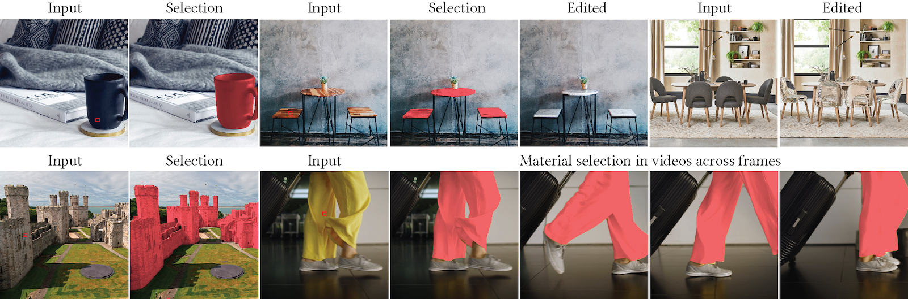

<p align="center">
  <h1 align="center">Materialistic: Selecting Similar Materials in Images</h1>
  <p align="center">
    <a href="https://prafullsharma.net/"><strong>Prafull Sharma</strong></a>
    ·
    <a href="https://julienphilip.com/"><strong>Julien Philip</strong></a>
    ·
    <a href="http://mgharbi.com/"><strong>Michaël Gharbi</strong></a>
    ·
    <a href="https://billf.mit.edu"><strong>William T. Freeman</strong></a>
    ·
    <a href="http://people.csail.mit.edu/fredo/"><strong>Frédo Durand</strong></a>
    ·
    <a href="https://valentin.deschaintre.fr/"><strong>Valentin Deschaintre</strong></a>
  </p>
  <h2 align="center">SIGGRAPH 2023 (Journal)</h2>
  <div align="center">
    
  </div>
  <p align="center">
  <br>
    <a href='https://prafullsharma.net/materialistic'>
      </a>
    <a href="https://arxiv.org/pdf/2305.13291.pdf"></a>
    <a href="http://materialistic.prafullsharma.net"></a>
  </p>
</p>

This repository contains the code for the paper [Materialistic: Selecting Similar Materials in Images](https://arxiv.org/abs/2305.13291), accepted as a journal paper in SIGGRAPH 2023.

## Setup
The code is written in python 3.9 and uses PyTorch along with pytorch-lightning for distributed training.
Please create a new conda environment with python 3.9 and run the `setup.sh` script to install all the dependencies.

```
conda create -n materialistic python=3.9
conda activate materialistic

sh setup.sh
```

## Dataset
Synthetic training dataset can be downloaded [here](https://data.csail.mit.edu/materialistic_siggraph/materialistic_synthetic_dataset.tar) to be stored in `data/materialistic_synthetic_dataset`.

Real images used for testing can be downloaded [here](https://drive.google.com/file/d/1R-q9NRrGmMsCZwNGj2gR64WXt-DavYQj/view?usp=sharing) to be stored in `data/materialistic_test_dataset`.

After running the setup script and placing the dataset and checkpoints in the correct location, the directory structure should look like this:
```
    .
    |-- code <-- this repository
    |   |-- checkpoints
    |   |-- ALL OTHER CONTENTS OF THIS REPOSITORY
    |
    |-- tensorboard
    |-- data
        |-- materialistic_synthetic_dataset
        |-- materialistic_real_dataset
```

## Pretrained Models
The pretrained models can be downloaded [here](https://drive.google.com/file/d/1AlHQ6InyVrYk6-F7P_1bHRctrzfi5Hhz/view?usp=sharing). Please unzip the file in the checkpoints folder.

## Training
```
python train.py --exp_name materialistic_transformer_model --epochs 30 --batch_size 8 --num_gpus 2  --config ./configs/transformer.cfg --data_dir ../data/materialistic_synthetic_dataset/ --lr 1e-4
```

## Testing
```
python test.py --exp_name materialistic_checkpoint --method_name materialistic_checkpoint --config ./configs/transformer.cfg --data_dir ../data/materialistic_real_dataset/
```

## Running the demo
```
python gradio_demo.py
```

## Acknowledgements
Part of the code is borrowed from [DPT](https://github.com/isl-org/DPT). We would like to thank Sameer Khurana for thoughtful discussions and feedback.

## Citation
```bibtex
@article{10.1145/3592390,
    author = {Sharma, Prafull and Philip, Julien and Gharbi, Micha\"{e}l and Freeman, Bill and Durand, Fredo and Deschaintre, Valentin},
    title = {Materialistic: Selecting Similar Materials in Images},
    year = {2023},
    issue_date = {August 2023},
    publisher = {Association for Computing Machinery},
    address = {New York, NY, USA},
    volume = {42},
    number = {4},
    issn = {0730-0301},
    url = {https://doi.org/10.1145/3592390},
    doi = {10.1145/3592390},
    journal = {ACM Trans. Graph.},
    month = {jul},
    articleno = {154},
    numpages = {14},
    keywords = {segmentation, selection, material}
}
```


